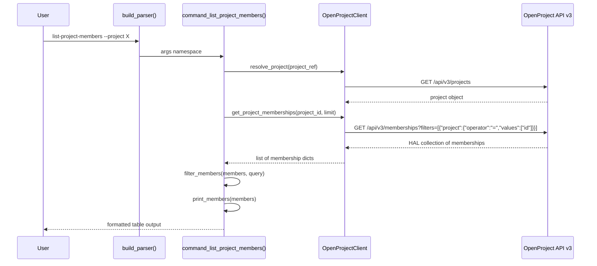

# Design Document: list-project-members

## Overview

This feature adds a `list-project-members` command to the OpenProject CLI that retrieves and displays project membership information using the `/api/v3/memberships` endpoint. Unlike the existing `list-users` command (which requires global admin permissions and often returns 403), this command is project-scoped and accessible to any user with project membership visibility.

The implementation follows the established CLI patterns: a client method on `OpenProjectClient`, a formatter function, a filter function, a command function, and a subparser registration in `build_parser()`. All code lives in the single file `scripts/openproject_cli.py`.

## Architecture

The command follows the same layered architecture as existing commands like `list-work-packages`:

```
CLI Parser (argparse) → Command Function → Client Method → OpenProject API v3
                                         → Filter Function (client-side)
                                         → Formatter Function → stdout
```



## Components and Interfaces

### 1. Client Method: `OpenProjectClient.get_project_memberships()`

```python
def get_project_memberships(self, project_id: int, limit: int = 200) -> List[Dict[str, Any]]:
```

- Calls `_collect_collection` on `/api/v3/memberships` with the project filter
- Filter syntax: `[{"project":{"operator":"=","values":["<project_id>"]}}]`
- Passes filter as `filters` query parameter (JSON-encoded string)
- Returns list of raw membership HAL objects
- Placement: after `get_activities()` method on `OpenProjectClient`

### 2. Filter Function: `filter_members()`

```python
def filter_members(members: List[Dict[str, Any]], query: Optional[str]) -> List[Dict[str, Any]]:
```

- Case-insensitive substring match on the principal name (`_links.principal.title`)
- Returns all members if query is None or empty
- Placement: near `filter_users()` / `filter_work_packages()`

### 3. Formatter Function: `print_members()`

```python
def print_members(members: List[Dict[str, Any]]) -> None:
```

- Prints a table with columns: ID, Name, Roles
- Extracts member name from `_links.principal.title` via `link_title()`
- Extracts member ID from `_links.principal.href` via `extract_numeric_id_from_href()`
- Extracts role names from `_links.roles` array (each element has a `title` field)
- Joins multiple roles with `, `
- Truncates name and roles to consistent widths using `truncate()`
- Prints "No members found." when list is empty
- Placement: near `print_users()`

### 4. Command Function: `command_list_project_members()`

```python
def command_list_project_members(args: argparse.Namespace) -> None:
```

- Uses `require_project()` for project resolution (supports `--project` arg and `OPENPROJECT_DEFAULT_PROJECT` env var)
- Calls `client.resolve_project()` to get project object and numeric ID
- Calls `client.get_project_memberships()` with project ID and limit
- Applies `filter_members()` with `--query` argument
- Prints project header line (matching `list-work-packages` pattern)
- Calls `print_members()` for formatted output
- Calls `maybe_print_json()` when `--debug-json` is set
- Placement: near `command_list_users()`

### 5. Parser Registration

- Subcommand name: `list-project-members`
- Arguments: `--project`, `--query`, `--limit` (default 200)
- Placement in `build_parser()`: after the `list-users` block, before `list-relations`

## Data Models

### Membership HAL Object (from API)

```json
{
  "id": 42,
  "_links": {
    "principal": {
      "href": "/api/v3/users/5",
      "title": "Jane Doe"
    },
    "roles": [
      { "href": "/api/v3/roles/3", "title": "Member" },
      { "href": "/api/v3/roles/7", "title": "Developer" }
    ],
    "project": {
      "href": "/api/v3/projects/1",
      "title": "My Project"
    }
  }
}
```

### Extracted Display Fields

| Field | Source | Example |
|-------|--------|---------|
| Member ID | `_links.principal.href` → `extract_numeric_id_from_href(href, "users")` | `5` |
| Member Name | `_links.principal.title` via `link_title(item, "principal")` | `Jane Doe` |
| Roles | `_links.roles[*].title` joined with `, ` | `Member, Developer` |

### Filter Syntax (API Query Parameter)

```
filters=[{"project":{"operator":"=","values":["<project_id>"]}}]
```

Passed as `params={"filters": json.dumps([...])}` to `_collect_collection`.


## Correctness Properties

*A property is a characteristic or behavior that should hold true across all valid executions of a system — essentially, a formal statement about what the system should do. Properties serve as the bridge between human-readable specifications and machine-verifiable correctness guarantees.*

### Property 1: Client method constructs correct API call

*For any* positive integer project ID and any positive integer limit, calling `get_project_memberships(project_id, limit)` should invoke `_collect_collection` with path `/api/v3/memberships`, a `filters` parameter containing `[{"project":{"operator":"=","values":["<project_id>"]}}]`, and the specified limit.

**Validates: Requirements 1.1, 1.5, 4.1**

### Property 2: Formatter output contains all required fields

*For any* membership object with a principal name, a principal ID (extracted from href), and one or more role names, the output of `print_members([membership])` should contain the principal name (or its truncation), the principal ID, and every role name (or their truncated comma-separated form).

**Validates: Requirements 2.1, 2.2, 2.3, 2.4, 2.6**

### Property 3: Filter returns only matching members

*For any* list of membership objects and any non-empty query string, every member returned by `filter_members(members, query)` should have a principal name that contains the query string (case-insensitive), and no member excluded by the filter should have a principal name containing the query string.

**Validates: Requirements 3.1**

### Property 4: Command output includes project header

*For any* project with an identifier, the output of `command_list_project_members` should include a line starting with `Project:` followed by the project identifier, before the member table.

**Validates: Requirements 6.3**

## Error Handling

Error handling follows the existing CLI patterns — fail closed with descriptive messages:

| Scenario | Mechanism | Behavior |
|----------|-----------|----------|
| API 403 (permission denied) | `_request` raises `OpenProjectError` | Command propagates error, CLI prints message and exits non-zero |
| Project not found | `resolve_project` raises `OpenProjectError` | Same propagation pattern |
| Unexpected API error | `_request` raises `OpenProjectError` with status code and extracted message | Same propagation pattern |
| Empty membership list | `print_members` handles empty list | Prints "No members found." |
| Filter yields no matches | `filter_members` returns empty list | `print_members` prints "No members found." |

No new error handling code is needed — the existing `OpenProjectError` propagation in `main()` handles all API errors. The formatter handles the empty-list case.

## Testing Strategy

### Unit Tests (`tests/test_project_members.py`)

Using `unittest` with `importlib.util` to load the CLI module (consistent with existing test files).

**Client method tests:**
- `get_project_memberships` calls `_collect_collection` with correct path and filter params
- Default limit of 200 is used when not specified

**Filter function tests:**
- Empty query returns all members
- Query matches case-insensitively on principal name
- No matches returns empty list

**Formatter tests:**
- Empty list prints "No members found."
- Single member with one role prints correct table row
- Member with multiple roles shows comma-separated roles

**Command tests:**
- Successful invocation prints project header and formatted members
- `--debug-json` flag triggers JSON output
- `require_project` fallback to env var
- Error propagation from `OpenProjectError`

**Parser tests:**
- `list-project-members` subcommand parses with `--project`, `--query`, `--limit`

### Property-Based Tests (`tests/test_project_members_properties.py`)

Using `hypothesis` with `pytest`. Each property test runs minimum 100 iterations via `@settings(max_examples=100)`.

**Property 1: Client method constructs correct API call**
- Generate random project IDs (positive integers) and limits
- Mock `_collect_collection`, invoke `get_project_memberships`
- Assert path, filter JSON structure, and limit are correct
- Tag: `Feature: list-project-members, Property 1: Client method constructs correct API call`

**Property 2: Formatter output contains all required fields**
- Generate random membership objects with random principal names, IDs, and 1-5 role names
- Use `from_regex` for names to avoid trailing-space issues
- Capture stdout from `print_members`, verify all fields present
- Tag: `Feature: list-project-members, Property 2: Formatter output contains all required fields`

**Property 3: Filter returns only matching members**
- Generate random lists of membership objects and a random query string
- Apply `filter_members`, verify all results contain query (case-insensitive) and no excluded members contain it
- Tag: `Feature: list-project-members, Property 3: Filter returns only matching members`

**Property 4: Command output includes project header**
- Generate random project identifiers
- Mock client, invoke command, verify output starts with `Project: <identifier>`
- Tag: `Feature: list-project-members, Property 4: Command output includes project header`

### Test Configuration

- Property tests: `hypothesis` library with `@settings(max_examples=100)`
- Use `from_regex` strategies (not `st.text().filter(...)`) to avoid health check warnings
- Unit tests: `python -m unittest discover -s tests -p "test_project_members.py"`
- Property tests: `python -m pytest tests/test_project_members_properties.py -v`
- Mock `build_client_from_env` for command-level tests
- Mock `_collect_collection` on client instances for client-method tests
- Use `io.StringIO` + `contextlib.redirect_stdout` for capturing output
