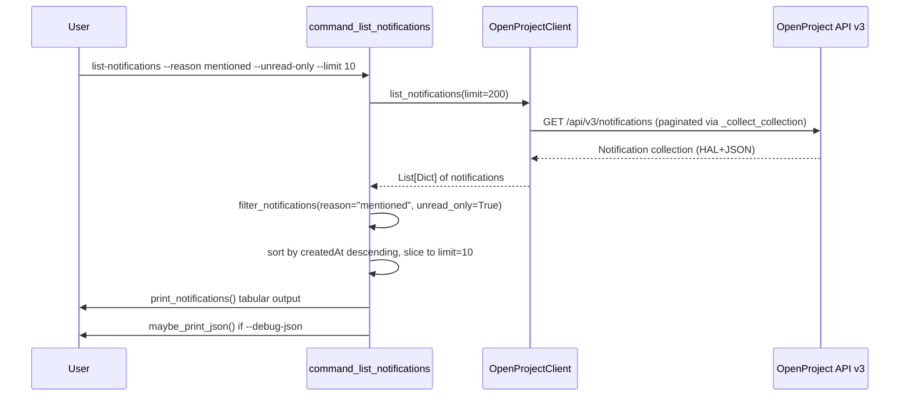
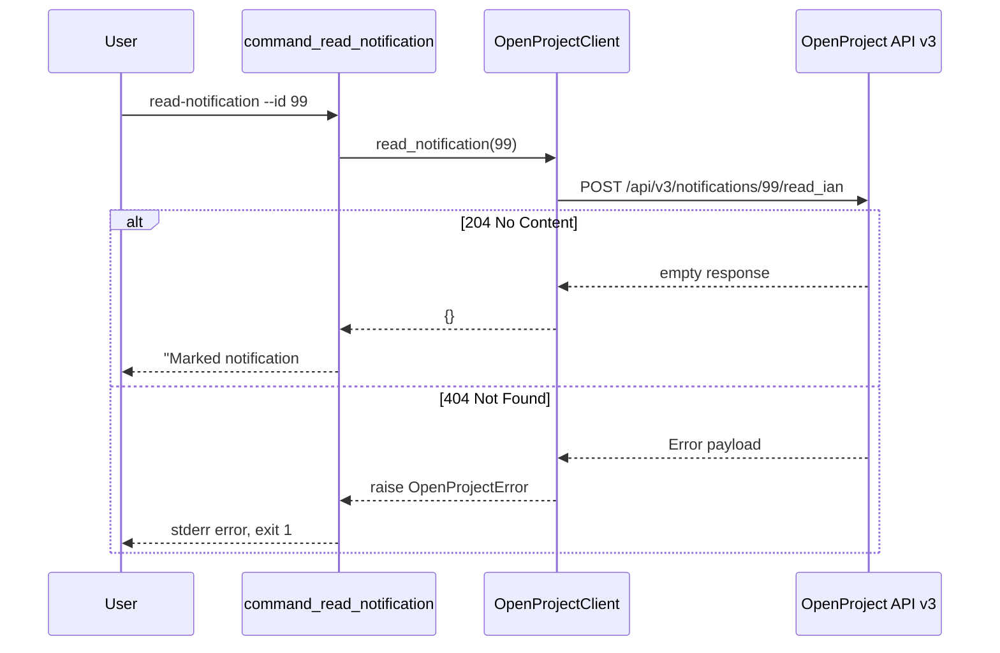

# Design Document: notifications

## Overview

This feature adds five notification management commands to the OpenProject CLI: `list-notifications`, `get-notification`, `read-notification`, `unread-notification`, and `read-all-notifications`. These wrap the OpenProject API v3 `/api/v3/notifications` endpoints, enabling users to view, inspect, and manage in-app notifications (IAN) from the command line.

The implementation follows established CLI patterns: thin client methods on `OpenProjectClient` that call `_request()` or `_collect_collection()`, filter/formatter helper functions, command functions that wire argparse to the client, and subparser registration in `build_parser()`.

## Architecture

No new modules or architectural changes. All code lives in `scripts/openproject_cli.py`. The data flow for each command follows the same pattern:

```
CLI args (argparse)
  → command_*() function
    → client method (list_notifications / get_notification / read_notification / etc.)
      → _request() or _collect_collection()
        → OpenProject API v3
      ← returns notification data or empty dict (204)
    → filter_notifications() (for list command only)
    → print_notifications() / print_notification_detail() / confirmation message
    → maybe_print_json()
```





## Components and Interfaces

### 1. Client Methods (OpenProjectClient)

All five methods go in the `OpenProjectClient` class, immediately after `get_activities()` (around line 890).

#### `list_notifications(self, limit: int = 200) -> List[Dict[str, Any]]`
- Calls `self._collect_collection("/notifications", limit=limit)`
- Returns a list of Notification dicts
- Pagination handled by existing `_collect_collection` helper

#### `get_notification(self, notification_id: int) -> Dict[str, Any]`
- Calls `self._request("GET", f"/notifications/{notification_id}", expected_statuses=(200,))`
- Returns a single Notification dict

#### `read_notification(self, notification_id: int) -> Dict[str, Any]`
- Calls `self._request("POST", f"/notifications/{notification_id}/read_ian", expected_statuses=(204,))`
- Returns `{}` (204 No Content)

#### `unread_notification(self, notification_id: int) -> Dict[str, Any]`
- Calls `self._request("POST", f"/notifications/{notification_id}/unread_ian", expected_statuses=(204,))`
- Returns `{}` (204 No Content)

#### `read_all_notifications(self) -> Dict[str, Any]`
- Calls `self._request("POST", "/notifications/read_ian", expected_statuses=(204,))`
- Returns `{}` (204 No Content)

### 2. Filter Function

#### `filter_notifications(notifications, reason=None, unread_only=False) -> List[Dict[str, Any]]`

Client-side filter applied after fetching all notifications. Follows the same pattern as `filter_work_packages()`.

- `reason`: case-insensitive match against `notification["reason"]` (the `_links.reason.title` or top-level `reason` field)
- `unread_only`: if True, keep only notifications where `readIAN` is `False`
- Returns filtered list

**Placement**: near `filter_work_packages()` / `filter_users()` (around line 1140).

### 3. Formatter Functions

**Placement**: near `print_work_packages()` / `print_work_package_detail()` (around line 1300).

#### `print_notifications(notifications: List[Dict[str, Any]]) -> None`

Tabular formatter for the list view. Columns: ID, Reason, Resource Subject, Project, Read, Created.

- Uses `truncate()` for resource subject
- Uses `format_date()` for createdAt
- Extracts project name from `_links.project.title`
- Extracts resource subject from `_links.resource.title`
- Displays read status as `Yes`/`No` from `readIAN` boolean

#### `print_notification_detail(notification: Dict[str, Any]) -> None`

Detail formatter for a single notification. Displays:
- Notification ID, reason, read status, creation timestamp
- Resource type (from `_links.resource.title` or `_type` in embedded resource)
- Resource subject, resource ID (extracted from `_links.resource.href`)
- Project name (from `_links.project.title`)

### 4. Command Functions

**Placement**: after `command_log_decision()` and before `build_parser()`.

#### `command_list_notifications(args: argparse.Namespace) -> None`
1. Calls `client.list_notifications()`
2. Saves raw data for `--debug-json`
3. Applies `filter_notifications(reason=args.reason, unread_only=args.unread_only)`
4. Sorts by `createdAt` descending
5. Slices to `args.limit` if provided
6. Prints via `print_notifications()` or "No notifications found." message
7. Calls `maybe_print_json()`

#### `command_get_notification(args: argparse.Namespace) -> None`
1. Calls `client.get_notification(args.id)`
2. Prints via `print_notification_detail()`
3. Calls `maybe_print_json()`

#### `command_read_notification(args: argparse.Namespace) -> None`
1. Calls `client.read_notification(args.id)`
2. Prints `"Marked notification #{id} as read."`
3. Calls `maybe_print_json()`

#### `command_unread_notification(args: argparse.Namespace) -> None`
1. Calls `client.unread_notification(args.id)`
2. Prints `"Marked notification #{id} as unread."`
3. Calls `maybe_print_json()`

#### `command_read_all_notifications(args: argparse.Namespace) -> None`
1. Calls `client.read_all_notifications()`
2. Prints `"All notifications marked as read."`
3. Calls `maybe_print_json()`

### 5. Parser Registration in `build_parser()`

Five new subparsers registered after the `log-decision` block and before `return parser`:

#### `list-notifications`
- `--reason` (optional): filter by notification reason (e.g., `mentioned`, `assigned`)
- `--unread-only` (optional, `store_true`): show only unread notifications
- `--limit` (optional, `type=positive_int`): max number of notifications to display
- Defaults: `func=command_list_notifications`

#### `get-notification`
- `--id` (required, `type=positive_int`): notification ID
- Defaults: `func=command_get_notification`

#### `read-notification`
- `--id` (required, `type=positive_int`): notification ID
- Defaults: `func=command_read_notification`

#### `unread-notification`
- `--id` (required, `type=positive_int`): notification ID
- Defaults: `func=command_unread_notification`

#### `read-all-notifications`
- No arguments
- Defaults: `func=command_read_all_notifications`

### 6. Documentation Updates

Add all five notification commands to SKILL.md Supported Operations and README.md Command Reference table.

## Data Models

No new data models or classes. The feature uses existing types throughout:

- **Notification dict** (from API): HAL+JSON object with fields `id`, `reason`, `readIAN` (boolean), `createdAt`, and `_links` containing `project`, `resource`, `actor`, `activity`
- **Input types**: `notification_id: int`, `reason: Optional[str]`, `unread_only: bool`, `limit: Optional[int]`
- **API responses**: 
  - `GET /notifications` → HAL collection with `_embedded.elements` (list of Notification dicts)
  - `GET /notifications/{id}` → single Notification dict
  - `POST /notifications/{id}/read_ian` → 204 No Content (empty body)
  - `POST /notifications/{id}/unread_ian` → 204 No Content (empty body)
  - `POST /notifications/read_ian` → 204 No Content (empty body)
- **Error**: `OpenProjectError(message, status_code)` — existing exception class

Example Notification structure from the API:
```json
{
  "id": 42,
  "reason": "mentioned",
  "readIAN": false,
  "createdAt": "2025-01-15T10:30:00Z",
  "_links": {
    "project": { "href": "/api/v3/projects/5", "title": "My Project" },
    "resource": { "href": "/api/v3/work_packages/123", "title": "Fix login bug" },
    "actor": { "href": "/api/v3/users/7", "title": "Jane Doe" },
    "activity": { "href": "/api/v3/activities/456" }
  }
}
```

## Correctness Properties

*A property is a characteristic or behavior that should hold true across all valid executions of a system — essentially, a formal statement about what the system should do. Properties serve as the bridge between human-readable specifications and machine-verifiable correctness guarantees.*

### Property 1: list_notifications uses _collect_collection with correct path

*For any* positive integer `limit`, calling `list_notifications(limit)` should invoke `_collect_collection("/notifications", limit=limit)` and return the result unchanged.

**Validates: Requirements 1.1, 6.5**

### Property 2: Client methods construct correct requests

*For any* positive integer `notification_id`:
- `get_notification(notification_id)` should call `_request("GET", "/notifications/{notification_id}", expected_statuses=(200,))`
- `read_notification(notification_id)` should call `_request("POST", "/notifications/{notification_id}/read_ian", expected_statuses=(204,))`
- `unread_notification(notification_id)` should call `_request("POST", "/notifications/{notification_id}/unread_ian", expected_statuses=(204,))`

Each method should return the result of `_request()` unchanged.

**Validates: Requirements 2.1, 3.1, 4.1**

### Property 3: Read/unread confirmation messages include notification ID

*For any* positive integer `notification_id`, when `command_read_notification` or `command_unread_notification` succeeds, the stdout output should contain the string representation of `notification_id`.

**Validates: Requirements 3.2, 4.2**

### Property 4: filter_notifications correctly filters by reason and unread_only

*For any* list of notification dicts with random `reason` strings and `readIAN` booleans, and *for any* reason filter string:
- When `reason` is provided, all returned notifications should have a reason matching the filter (case-insensitive)
- When `unread_only=True`, all returned notifications should have `readIAN == False`
- When both filters are applied, both conditions should hold simultaneously

**Validates: Requirements 1.3, 1.4**

### Property 5: List formatter output contains required fields

*For any* notification dict with a non-empty ID, reason, resource subject, project name, read status, and creation timestamp, the output of `print_notifications([notification])` should contain the string representations of the notification ID, reason, and project name.

**Validates: Requirements 1.2**

### Property 6: Detail formatter output contains required fields

*For any* notification dict with a non-empty ID, reason, read status, creation timestamp, resource subject, and project name, the output of `print_notification_detail(notification)` should contain the string representations of the notification ID, reason, and project name.

**Validates: Requirements 2.2**

### Property 7: Limit constrains output size

*For any* list of notification dicts of length L and *for any* positive integer N, applying the limit N to the list should produce a result of length `min(L, N)`.

**Validates: Requirements 1.5**

### Property 8: Notifications are sorted by createdAt descending

*For any* list of notification dicts with random `createdAt` ISO timestamps, after sorting by `createdAt` descending, each notification's `createdAt` should be greater than or equal to the next notification's `createdAt`.

**Validates: Requirements 6.1**

## Error Handling

Error handling follows existing CLI patterns. No new error handling mechanisms are introduced.

| Scenario | Layer | Behavior |
|---|---|---|
| Non-positive `--id` | argparse (`positive_int` type) | `argparse.ArgumentTypeError` → argparse prints usage + error, exits 2 |
| Invalid `--limit` (zero/negative) | argparse (`positive_int` type) | `argparse.ArgumentTypeError` → argparse prints usage + error, exits 2 |
| HTTP 401/403 | `_request()` | Raises `OpenProjectError` with auth failure message |
| HTTP 404 (notification not found) | `_request()` | Raises `OpenProjectError` with status + detail |
| Other HTTP errors | `_request()` | Raises `OpenProjectError` with status code + extracted detail |
| Network failure | `_request()` | Raises `OpenProjectError` wrapping `requests.RequestException` |
| No notifications match filters | `command_list_notifications` | Prints "No notifications found." to stdout, exits 0 |
| `OpenProjectError` in any command | `main()` | Prints message to stderr, exits with code 1 |

## Testing Strategy

### Unit Tests (unittest)

Unit tests cover specific examples, edge cases, and integration points. File: `tests/test_notifications.py`.

Tests to write:
1. **`list_notifications` client method**: mock `_collect_collection`, verify it's called with `"/notifications"` and correct limit
2. **`get_notification` client method**: mock `_request`, verify GET path and expected_statuses
3. **`read_notification` client method**: mock `_request`, verify POST path to `/read_ian` with expected_statuses=(204,)
4. **`unread_notification` client method**: mock `_request`, verify POST path to `/unread_ian` with expected_statuses=(204,)
5. **`read_all_notifications` client method**: mock `_request`, verify POST path to `/notifications/read_ian` with expected_statuses=(204,)
6. **`filter_notifications` with reason**: verify case-insensitive reason matching
7. **`filter_notifications` with unread_only**: verify only readIAN=False kept
8. **`filter_notifications` with no filters**: verify all notifications returned
9. **`print_notifications` output**: verify tabular output contains expected columns
10. **`print_notification_detail` output**: verify detail output contains expected fields
11. **`command_list_notifications` success**: mock client, verify formatted output
12. **`command_list_notifications` empty result**: verify "No notifications found." message
13. **`command_get_notification` success**: mock client, verify detail output
14. **`command_read_notification` success**: mock client, verify confirmation message
15. **`command_unread_notification` success**: mock client, verify confirmation message
16. **`command_read_all_notifications` success**: mock client, verify confirmation message
17. **`command_list_notifications` with `--debug-json`**: verify JSON output appears
18. **Parser registration**: verify all five subcommands parse correctly
19. **Error propagation**: mock client raising `OpenProjectError`, verify it propagates

### Property Tests (hypothesis + pytest)

Property tests verify universal properties across randomized inputs. File: `tests/test_notifications_properties.py`.

Library: `hypothesis` (install separately: `pip install hypothesis`).
Runner: `pytest` (property tests coexist with unittest tests in `tests/`).
Configuration: `@settings(max_examples=100)` per test.

Each property test references its design document property:

1. **Feature: notifications, Property 1: list_notifications uses _collect_collection with correct path**
   - Strategy: `st.integers(min_value=1, max_value=10_000)` for limit
   - Mock `_collect_collection`, call `list_notifications`, assert path and limit args

2. **Feature: notifications, Property 2: Client methods construct correct requests**
   - Strategy: `st.integers(min_value=1, max_value=10_000_000)` for notification_id
   - Mock `_request`, call each of `get_notification`, `read_notification`, `unread_notification`, assert method/path/expected_statuses

3. **Feature: notifications, Property 3: Read/unread confirmation messages include notification ID**
   - Strategy: `st.integers(min_value=1, max_value=10_000_000)` for notification_id
   - Mock `build_client_from_env`, capture stdout, assert ID string present in output

4. **Feature: notifications, Property 4: filter_notifications correctly filters by reason and unread_only**
   - Strategy: `st.lists(st.fixed_dictionaries({"reason": st.from_regex(r"[a-z]{3,15}", fullmatch=True), "readIAN": st.booleans()}))` for notifications, `st.from_regex(r"[a-z]{3,15}", fullmatch=True)` for reason filter
   - Call `filter_notifications`, assert all results match filter criteria

5. **Feature: notifications, Property 5: List formatter output contains required fields**
   - Strategy: generate random notification dicts with `st.integers` for ID, `st.from_regex` for reason/project/subject
   - Capture stdout from `print_notifications`, assert required field values present

6. **Feature: notifications, Property 6: Detail formatter output contains required fields**
   - Strategy: same as Property 5
   - Capture stdout from `print_notification_detail`, assert required field values present

7. **Feature: notifications, Property 7: Limit constrains output size**
   - Strategy: `st.lists(st.fixed_dictionaries(...))` for notifications, `st.integers(min_value=1, max_value=100)` for limit
   - Assert `len(result) == min(len(notifications), limit)`

8. **Feature: notifications, Property 8: Notifications are sorted by createdAt descending**
   - Strategy: `st.lists(st.fixed_dictionaries({"createdAt": st.from_regex(r"2025-0[1-9]-[012][0-9]T[01][0-9]:[0-5][0-9]:[0-5][0-9]Z", fullmatch=True)}))` for notifications
   - Sort, then assert each pair `sorted_list[i]["createdAt"] >= sorted_list[i+1]["createdAt"]`
