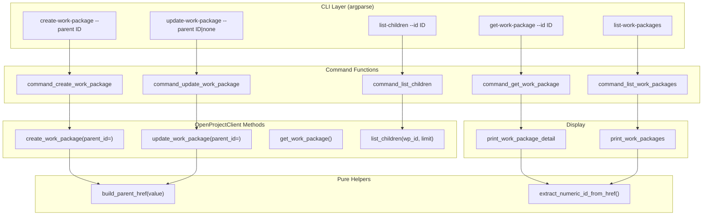

# Design Document: Parent-Child Work Packages

## Overview

This feature adds parent-child hierarchy support to the OpenProject CLI. It enables users to set, change, remove, and query parent-child relationships between work packages using the OpenProject API v3 `_links.parent` mechanism.

The implementation touches four layers of the single-file CLI (`scripts/openproject_cli.py`):

1. A pure helper function `build_parent_href(value)` that converts a user-supplied parent value (positive int or `"none"`) into the correct HAL href or `None`.
2. Extended client methods `create_work_package()` and `update_work_package()` to accept an optional `parent_id` parameter and include `_links.parent` in the API payload.
3. A new client method `list_children(work_package_id, limit)` that queries work packages filtered by parent.
4. Updated formatters (`print_work_package_detail`, `print_work_packages`) and new command functions (`command_list_children`) with corresponding argparse subparser registration.

No new files are created. All code lives in `scripts/openproject_cli.py` per project convention.

## Architecture



The data flow is straightforward:

- **Create/Update**: User passes `--parent <ID>` or `--parent none`. The command function calls `build_parent_href()` to produce the href string (or `None`), then passes it to the client method which includes `_links.parent` in the POST/PATCH payload.
- **Detail view**: `print_work_package_detail` reads `_links.parent.href` from the API response, extracts the numeric ID via `extract_numeric_id_from_href`, and optionally fetches the parent's subject for display.
- **List view**: `print_work_packages` reads `_links.parent.href` from each work package and shows the parent ID (or `-`).
- **List children**: The new `list_children` client method uses the API filter `[{"parent":{"operator":"=","values":["<id>"]}}]` to query children server-side.

## Components and Interfaces

### 1. `build_parent_href(value: str) -> Optional[str]`

Pure helper function. Placed near `extract_numeric_id_from_href`.

| Input | Output |
|---|---|
| `"42"` | `"/api/v3/work_packages/42"` |
| `"none"` (case-insensitive) | `None` |

Uses `API_PREFIX` constant for the prefix. Raises `ValueError` for non-positive-integer, non-"none" inputs.

### 2. `parent_id_or_none(value: str) -> str`

Argparse type function for the `--parent` flag. Accepts positive integers or the literal `"none"` (case-insensitive). Returns the string as-is for downstream processing. Raises `argparse.ArgumentTypeError` for invalid values.

### 3. `OpenProjectClient.create_work_package()` — extended signature

```python
def create_work_package(
    self,
    project: Dict[str, Any],
    subject: str,
    type_name: str = "Task",
    description: Optional[str] = None,
    parent_id: Optional[int] = None,  # NEW
) -> Dict[str, Any]:
```

When `parent_id` is provided, adds `"parent": {"href": build_parent_href(str(parent_id))}` to the `_links` dict in the POST payload.

### 4. `OpenProjectClient.update_work_package()` — extended signature

```python
def update_work_package(
    self,
    work_package_id: int,
    *,
    # ... existing params ...
    parent_ref: Optional[str] = None,  # NEW — "42" or "none"
) -> Dict[str, Any]:
```

When `parent_ref` is provided, calls `build_parent_href(parent_ref)` and adds `"parent": {"href": result}` to `link_updates`. A `None` href (from `"none"`) tells the API to unset the parent.

### 5. `OpenProjectClient.list_children(work_package_id: int, limit: int = 50) -> List[Dict[str, Any]]`

New client method. Queries `/work_packages` with a filter parameter:
```
[{"parent":{"operator":"=","values":["<work_package_id>"]}}]
```
Uses `_collect_collection` for pagination. Returns the list of child work packages.

### 6. Updated `print_work_package_detail`

After the existing fields, adds a `Parent:` line when `_links.parent.href` is present and non-null. Extracts the parent ID via `extract_numeric_id_from_href` and shows the parent's title from `_links.parent.title` (HAL responses include this). Omits the line entirely when there is no parent.

### 7. Updated `print_work_packages`

Adds a `Parent` column to the table header. For each work package, extracts the parent ID from `_links.parent.href` or displays `-` if no parent.

### 8. `command_list_children(args)` — new command function

Calls `client.list_children(args.id, limit=args.limit)`, then prints results using `print_work_packages`. Displays "No children found for work package #ID." when the list is empty.

### 9. Argparse registration

- `create-work-package`: add `--parent` with `type=positive_int`, optional.
- `update-work-package`: add `--parent` with `type=parent_id_or_none`, optional.
- `list-children`: new subparser with `--id` (required, `type=positive_int`) and `--limit` (optional, `type=positive_int`, default 50).

## Data Models

### API Payloads

**Create with parent** (POST `/api/v3/work_packages`):
```json
{
  "subject": "Child task",
  "_links": {
    "project": {"href": "/api/v3/projects/1"},
    "type": {"href": "/api/v3/types/1"},
    "parent": {"href": "/api/v3/work_packages/42"}
  }
}
```

**Update parent** (PATCH via `updateImmediately` href):
```json
{
  "lockVersion": 3,
  "_links": {
    "parent": {"href": "/api/v3/work_packages/42"}
  }
}
```

**Remove parent** (PATCH via `updateImmediately` href):
```json
{
  "lockVersion": 3,
  "_links": {
    "parent": {"href": null}
  }
}
```

### API Response Shape (relevant fields)

```json
{
  "id": 99,
  "subject": "Child task",
  "lockVersion": 3,
  "_links": {
    "parent": {
      "href": "/api/v3/work_packages/42",
      "title": "Parent epic"
    },
    "children": [
      {"href": "/api/v3/work_packages/100", "title": "Sub-task A"},
      {"href": "/api/v3/work_packages/101", "title": "Sub-task B"}
    ]
  }
}
```

When no parent: `"parent": {"href": null, "title": null}`.

### Filter for listing children

```
GET /api/v3/work_packages?filters=[{"parent":{"operator":"=","values":["42"]}}]
```

This is a standard OpenProject API v3 filter. The `_collect_collection` method handles pagination.


## Correctness Properties

*A property is a characteristic or behavior that should hold true across all valid executions of a system — essentially, a formal statement about what the system should do. Properties serve as the bridge between human-readable specifications and machine-verifiable correctness guarantees.*

### Property 1: Parent href round-trip

*For any* positive integer ID, building a parent href with `build_parent_href(str(id))` and then extracting the numeric ID from that href with `extract_numeric_id_from_href(href, "work_packages")` shall return the original ID.

**Validates: Requirements 8.1, 8.3**

### Property 2: "none" produces null href

*For any* case variation of the string `"none"` (e.g., `"none"`, `"None"`, `"NONE"`, `"nOnE"`), `build_parent_href(value)` shall return `None`.

**Validates: Requirements 3.1, 8.2**

### Property 3: Invalid parent values are rejected

*For any* string that is neither a positive integer nor a case-insensitive match for `"none"`, `parent_id_or_none(value)` shall raise `argparse.ArgumentTypeError`.

**Validates: Requirements 1.3, 2.3**

### Property 4: Detail view parent display

*For any* work package dict, `print_work_package_detail` shall include a `Parent:` line containing the parent work package ID if and only if `_links.parent.href` is a non-null string. When the parent href is null or absent, no `Parent:` line shall appear.

**Validates: Requirements 4.1, 4.2**

### Property 5: List view parent column

*For any* list of work package dicts, each row produced by `print_work_packages` shall display the parent work package ID extracted from `_links.parent.href` when present, or a dash (`-`) when the parent href is null or absent.

**Validates: Requirements 5.1, 5.2**

## Error Handling

Error handling follows the existing CLI patterns:

| Scenario | Source | Behavior |
|---|---|---|
| `--parent` value is not a positive integer or `"none"` | `parent_id_or_none` argparse type | argparse exits with error message, non-zero exit code |
| `--parent` value is not a positive integer (create only) | `positive_int` argparse type | argparse exits with error message, non-zero exit code |
| Parent work package does not exist | API returns 404 | `_request` raises `OpenProjectError` with status 404; `update_work_package` / `create_work_package` propagates it. CLI prints error and exits non-zero. |
| Circular hierarchy detected | API returns 422 | `_request` raises `OpenProjectError`; `update_work_package` catches 422 and re-raises with the API rejection message. CLI prints error and exits non-zero. |
| Other validation failure | API returns 422 | Same as circular — the API error detail is surfaced to the user. |
| No fields provided to update | `update_work_package` | Existing guard: raises `OpenProjectError("No fields provided to update.")` — `--parent` alone counts as a field, so this only fires when truly nothing is provided. |

No new error classes are introduced. The existing `OpenProjectError` and argparse error mechanisms are sufficient.

## Testing Strategy

### Unit Tests (unittest)

Unit tests verify specific examples, edge cases, and integration points using mocks:

- `build_parent_href("42")` returns `"/api/v3/work_packages/42"`
- `build_parent_href("none")` returns `None`
- `build_parent_href("None")` returns `None` (case-insensitive)
- `parent_id_or_none("42")` returns `"42"`
- `parent_id_or_none("none")` returns `"none"`
- `parent_id_or_none("abc")` raises `ArgumentTypeError`
- `parent_id_or_none("-1")` raises `ArgumentTypeError`
- `parent_id_or_none("0")` raises `ArgumentTypeError`
- `command_create_work_package` with `--parent 42` includes parent in API payload (mock client)
- `command_create_work_package` without `--parent` omits parent from payload (mock client)
- `command_update_work_package` with `--parent 42` includes parent href in PATCH payload (mock client)
- `command_update_work_package` with `--parent none` includes null parent href in PATCH payload (mock client)
- `command_list_children` with empty result prints "No children found" message
- `command_list_children` with results prints work package table
- `print_work_package_detail` with parent shows `Parent:` line
- `print_work_package_detail` without parent omits `Parent:` line
- API 404 error for non-existent parent surfaces clear message
- API 422 error for circular hierarchy surfaces API rejection reason

### Property Tests (hypothesis)

Property tests verify universal properties across randomly generated inputs. Each test references a design property and runs a minimum of 100 iterations.

Library: `hypothesis` (Python property-based testing library)
Configuration: `@settings(max_examples=100)`
Tag format: `# Feature: parent-child-work-packages, Property N: <title>`

| Property | Test Description | Strategy |
|---|---|---|
| Property 1 | Round-trip: `build_parent_href` → `extract_numeric_id_from_href` | `st.integers(min_value=1, max_value=10**9)` |
| Property 2 | "none" → `None` for all case variations | `st.sampled_from(...)` over case permutations of "none" |
| Property 3 | Invalid inputs rejected by `parent_id_or_none` | `st.from_regex(r"[a-zA-Z!@#$%^&*()]{1,20}")` filtered to exclude "none" variants and digit-only strings |
| Property 4 | Detail view parent display conditional on `_links.parent.href` | Composite strategy generating work package dicts with/without parent |
| Property 5 | List view parent column shows ID or dash | Composite strategy generating lists of work package dicts with mixed parent presence |

Property tests live in `tests/test_parent_child_properties.py`. Unit tests live in `tests/test_parent_child.py`. Both follow existing project conventions (importlib.util loading, io.StringIO for stdout capture, MagicMock for client).
