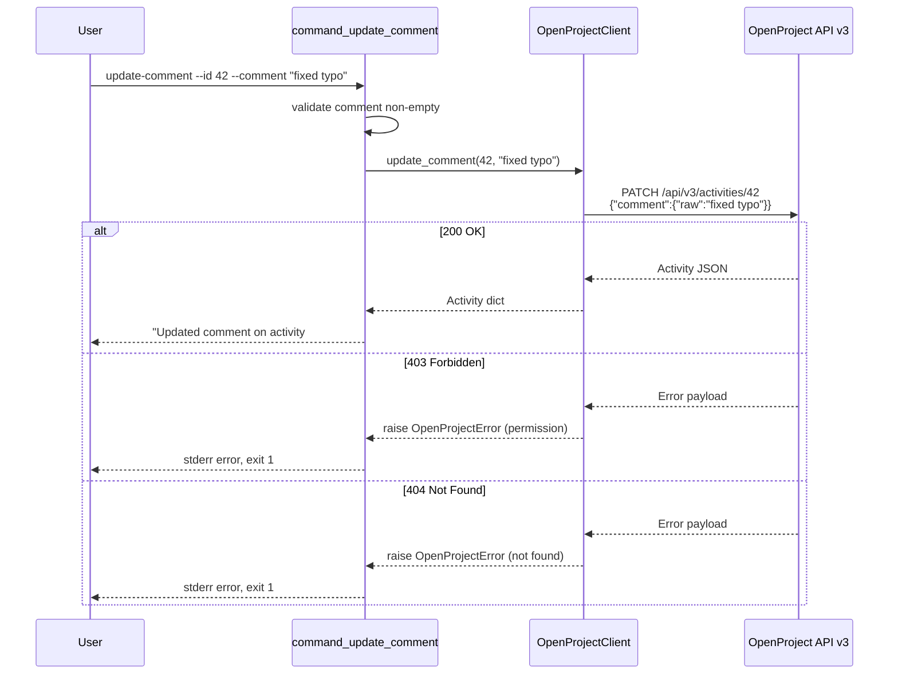

# Design Document: update-comment

## Overview

This feature adds an `update_comment()` method to `OpenProjectClient` and a corresponding `update-comment` CLI subcommand. It sends a `PATCH /api/v3/activities/{id}` request with `{"comment": {"raw": "<text>"}}` to edit an existing comment's text. The implementation follows the same patterns established by `add_comment()` / `command_add_comment` — a thin client method that calls `_request()`, a command function that wires argparse to the client, and input validation at both the parser and command level.

The feature rounds out the comment lifecycle: `add-comment` → `list-comments` → `update-comment`.

## Architecture

No new modules or architectural changes. All code lives in `scripts/openproject_cli.py` as a single-file CLI. The data flow is:

```
CLI args (argparse)
  → command_update_comment()
    → validates non-empty comment
    → client.update_comment(activity_id, comment_text)
      → client._request("PATCH", "/activities/{id}", payload=...)
        → OpenProject API v3
      ← returns updated Activity dict (or raises OpenProjectError)
    ← prints confirmation / debug JSON
```



## Components and Interfaces

### 1. `OpenProjectClient.update_comment(activity_id: int, comment: str) -> Dict[str, Any]`

Client method that sends the PATCH request. Mirrors the simplicity of `add_comment()` but targets a specific activity rather than a work package.

- Calls `self._request("PATCH", f"/activities/{activity_id}", payload={"comment": {"raw": comment}}, expected_statuses=(200,))`
- Returns the updated Activity dict on success
- Relies on `_request()` for error propagation — 403/404/other errors raise `OpenProjectError` with status code and detail automatically

Unlike `add_comment()`, this method does NOT need to fetch the work package first or resolve any HAL links. The activity ID directly maps to the API path.

**Placement**: immediately after `add_comment()` in the client class (around line 871).

### 2. `command_update_comment(args: argparse.Namespace) -> None`

Command function that:
1. Validates `args.comment` is not empty/whitespace — raises `OpenProjectError` if so
2. Calls `client.update_comment(args.id, args.comment)`
3. Prints `"Updated comment on activity #{id}."` to stdout
4. Calls `maybe_print_json(result, args.debug_json)` for debug output
5. Catches `OpenProjectError` via the existing `main()` error handler (prints to stderr, exits non-zero)

**Placement**: immediately after `command_add_comment()` (around line 1510).

### 3. Parser registration in `build_parser()`

Registers `update-comment` subparser with:
- `--id` (type=int, required=True) — activity ID. Argparse enforces positive integer via a custom type function or post-validation. Since argparse `type=int` accepts negative integers and zero, we use a `positive_int` type function (consistent with how other CLIs handle this) to reject non-positive values at parse time.
- `--comment` (required=True) — new comment text

**Placement**: after the `list-comments` subparser block, before `get-work-package`.

### 4. `positive_int(value: str) -> int` helper

A small argparse type function that converts a string to int and raises `argparse.ArgumentTypeError` if the result is not positive. This gives clean argparse error messages for `--id 0`, `--id -5`, or `--id abc`.

**Placement**: near other helper functions, before the command functions.

### 5. SKILL.md and README.md updates

Add `update-comment` to the Supported Operations list and agent behavior guidance in SKILL.md. Update README.md if it documents CLI commands.

## Data Models

No new data models. The feature uses existing types:

- **Input**: `activity_id: int`, `comment: str` (raw Markdown text)
- **API Payload**: `{"comment": {"raw": "<text>"}}` — same formattable text shape used by `add_comment()`
- **API Response**: Activity dict (HAL+JSON) — same `_type: "Activity"` shape returned by `get_activities()`
- **Error**: `OpenProjectError(message, status_code)` — existing exception class

The Activity resource from the API includes fields like `id`, `comment` (formattable), `_links.user`, `createdAt`, `updatedAt`, and `_links.update` (present when the user has edit permission).


## Correctness Properties

*A property is a characteristic or behavior that should hold true across all valid executions of a system — essentially, a formal statement about what the system should do. Properties serve as the bridge between human-readable specifications and machine-verifiable correctness guarantees.*

### Property 1: update_comment constructs correct PATCH request and returns result

*For any* positive integer `activity_id` and *for any* non-empty string `comment`, calling `update_comment(activity_id, comment)` should invoke `_request("PATCH", "/activities/{activity_id}", payload={"comment": {"raw": comment}}, expected_statuses=(200,))` and return the result unchanged.

**Validates: Requirements 1.1, 1.2**

### Property 2: Confirmation message includes activity ID

*For any* positive integer `activity_id` and *for any* non-empty string `comment`, when `command_update_comment` succeeds, the stdout output should contain the string representation of `activity_id`.

**Validates: Requirements 2.2**

### Property 3: Parser rejects non-positive integer IDs

*For any* integer that is zero or negative, and *for any* non-numeric string, passing it as the `--id` argument to the `update-comment` subparser should cause argparse to reject the input (raise `SystemExit`) before any API call is made.

**Validates: Requirements 3.1**

### Property 4: Whitespace-only comments are rejected

*For any* string composed entirely of whitespace characters (including the empty string), invoking `command_update_comment` with that string as the comment should raise an `OpenProjectError` without making any API call.

**Validates: Requirements 3.2**

## Error Handling

Error handling follows the existing CLI patterns:

| Scenario | Layer | Behavior |
|---|---|---|
| Non-positive `--id` | argparse (`positive_int` type) | `argparse.ArgumentTypeError` → argparse prints usage + error, exits 2 |
| Empty/whitespace `--comment` | `command_update_comment` | Raises `OpenProjectError("Comment text must not be empty.")` |
| HTTP 403 | `_request()` | Raises `OpenProjectError` with auth failure message, `status_code=403` |
| HTTP 404 | `_request()` | Raises `OpenProjectError` with status + detail, `status_code=404` |
| Other HTTP errors | `_request()` | Raises `OpenProjectError` with status code + extracted detail |
| Network failure | `_request()` | Raises `OpenProjectError` wrapping `requests.RequestException` |
| `OpenProjectError` in command | `main()` | Prints message to stderr, exits with code 1 |

No new error handling patterns are introduced. The `_request()` method already handles all HTTP error cases. The only new validation is the empty-comment check in `command_update_comment` and the `positive_int` type function for argparse.

## Testing Strategy

### Unit Tests (unittest)

Unit tests cover specific examples, edge cases, and integration points. File: `tests/test_update_comment.py`.

Tests to write:
1. **`positive_int` helper**: valid positive int returns int; zero, negative, and non-numeric strings raise `ArgumentTypeError`
2. **Parser registration**: `update-comment --id 42 --comment "hello"` parses correctly; missing `--id` or `--comment` causes `SystemExit`
3. **`command_update_comment` success**: mock client, verify confirmation message printed to stdout
4. **`command_update_comment` with `--debug-json`**: mock client returning a dict, verify JSON appears in stdout
5. **`command_update_comment` error propagation**: mock client raising `OpenProjectError`, verify it propagates
6. **`update_comment` with 403**: mock `_request` raising `OpenProjectError(status_code=403)`, verify it propagates
7. **`update_comment` with 404**: mock `_request` raising `OpenProjectError(status_code=404)`, verify it propagates

### Property Tests (hypothesis + pytest)

Property tests verify universal properties across randomized inputs. File: `tests/test_update_comment_properties.py`.

Library: `hypothesis` (install separately: `pip install hypothesis`).
Runner: `pytest` (property tests coexist with unittest tests in `tests/`).
Configuration: `@settings(max_examples=100)` per test.

Each property test references its design document property:

1. **Feature: update-comment, Property 1: update_comment constructs correct PATCH request and returns result**
   - Strategy: `st.integers(min_value=1, max_value=10_000_000)` for activity_id, `st.text(min_size=1, alphabet=st.characters(blacklist_categories=("Cs",)))` for comment
   - Mock `_request`, call `update_comment`, assert args and return value

2. **Feature: update-comment, Property 2: Confirmation message includes activity ID**
   - Strategy: same as Property 1
   - Mock `build_client_from_env`, capture stdout, assert activity ID string present

3. **Feature: update-comment, Property 3: Parser rejects non-positive integer IDs**
   - Strategy: `st.integers(max_value=0)` for non-positive ints, `st.from_regex(r"[a-zA-Z]+", fullmatch=True)` for non-numeric strings
   - Parse args, assert `SystemExit` raised

4. **Feature: update-comment, Property 4: Whitespace-only comments are rejected**
   - Strategy: `st.from_regex(r"\s*", fullmatch=True)` for whitespace-only strings (including empty)
   - Mock client, call `command_update_comment`, assert `OpenProjectError` raised
